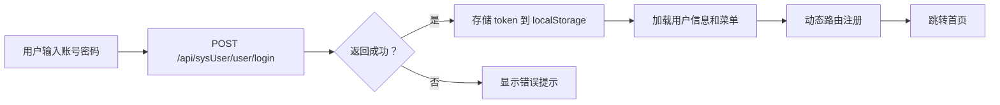
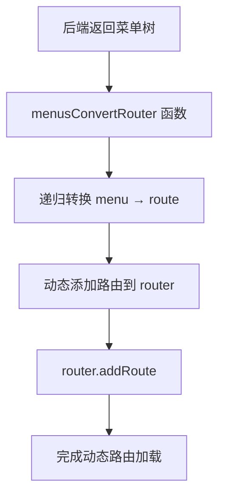

# 账单管理系统前端 - 功能总结文档

本文档用于帮助其他 AI 理解本项目并生成可预览的 HTML 页面。

---

## 📋 项目概述

这是一个基于 **Vue 3 + TypeScript + Layui-Vue** 的现代化管理系统前端项目，主要用于家庭账单管理和系统配置。

### 技术栈

| 类别 | 技术 | 版本 |
|------|------|------|
| 框架 | Vue.js | 3.5.22 |
| 语言 | TypeScript | ~5.9.0 |
| UI 框架 | Layui-Vue | 2.23.3 |
| 状态管理 | Pinia | 3.0.3 |
| 路由 | Vue Router | 4.5.1 |
| HTTP | Axios | 1.12.2 |
| 图表 | ECharts | 6.0.0 |
| 构建工具 | Vite | 7.1.7 |
| Excel | xlsx | 0.18.5 |
| Word 解析 | mammoth | 1.11.0 |
| 图片预览 | viewerjs | 1.11.7 |

---

## 🏗️ 项目结构

```
bill-layui/
├── public/                      # 静态资源
│   ├── imgs/                    # 图片资源
│   └── cityGeoJson/             # 城市地理 JSON 数据
├── src/
│   ├── api/                     # API 接口层
│   │   ├── module/              # 模块化 API
│   │   │   ├── bill/            # 账单业务 API
│   │   │   └── sys*.ts          # 系统管理 API
│   │   ├── common.ts            # 通用 API
│   │   ├── manage.ts            # Axios 方法封装
│   │   └── requestUrlConfig.ts  # 后端路径配置
│   ├── assets/                  # 静态资源
│   │   ├── icons/               # 字体图标
│   │   ├── images/              # 图片资源
│   │   └── styles/              # CSS 样式
│   ├── config/                  # 配置文件
│   │   └── pinia.ts             # Pinia 配置
│   ├── interface/               # TypeScript 接口定义
│   │   ├── system/              # 系统管理接口
│   │   └── bill/                # 账单业务接口
│   ├── layouts/                 # 布局组件
│   │   ├── BasicLayout.vue      # 主布局
│   │   └── *.vue                # 子组件
│   ├── router/                  # 路由配置
│   │   ├── index.ts             # 路由实例
│   │   ├── dynamicRoute.ts      # 动态路由
│   │   └── routes.ts            # 静态路由
│   ├── stores/                  # Pinia 状态管理
│   │   ├── user.ts              # 用户状态
│   │   └── app.ts               # 应用配置
│   ├── utils/                   # 工具函数
│   │   ├── request.ts           # 请求封装
│   │   ├── echarts.ts           # ECharts 配置
│   │   ├── mapDataService.ts    # 地图服务
│   │   ├── dateUtil.ts          # 日期工具
│   │   ├── treeUtil.ts          # 树形工具
│   │   ├── fileUtil.ts          # 文件工具
│   │   └── ...                  # 其他工具
│   ├── views/                   # 页面组件
│   │   ├── bill/                # 账单模块
│   │   ├── system/              # 系统管理
│   │   ├── individual/          # 个人中心
│   │   └── component/           # 组件示例
│   ├── App.vue                  # 根组件
│   └── main.ts                  # 入口文件
└── package.json
```

---

## 🎨 核心布局设计

### 布局结构

```
┌─────────────────────────────────────────────────────────┐
│                    顶部导航栏 (Header)                    │
│  [折叠] [Logo] [面包屑] [刷新] [全屏] [消息] [用户头像]   │
├──────────────┬──────────────────────────────────────────┤
│   侧边菜单    │           标签页 (Tab)                    │
│   - 图标模式  ├──────────────────────────────────────────┤
│   - 支持折叠  │                                           │
│               │        主要内容区域 (Body)                │
│               │        - 留白容器                          │
│               │        - Keep-Alive 缓存                   │
└──────────────┴──────────────────────────────────────────┘
│                       页脚 (Footer)                        │
└─────────────────────────────────────────────────────────┘
```

### 主题颜色系统

| 变量名 | 值 | 用途 |
|-------|-----|------|
| `--global-primary-color` | `#16baaa` | 主色调 (品牌色) |
| `--global-normal-color` | `#1e9fff` | 通用蓝 |
| `--global-warm-color` | `#ffb800` | 警告色 |
| `--global-danger-color` | `#ff5722` | 危险色 |
| `--global-checked-color` | `#16b777` | 选中/确认色 |
| `--global-info-color` | `#31bdec` | 信息色 |

### 图标系统

项目使用自定义字体图标 (iconfont)，主要包含：
- 信用卡、红包、转账相关图标
- 薪资、社保、投资相关图标
- 日志管理、权限管理相关图标
- 账单统计、收支分析相关图标

完整图标列表见 `src/assets/icons/iconfont.css`

---

## 🔑 核心功能模块

### 1. 认证模块 (Login)

**路径**: `/login`

**功能**:
- 账号密码登录
- 手机验证码登录
- 记住自动登录
- 动态渐变背景

**关键文件**:
- `views/login/LoginViewNew.vue` - 主登录页
- `views/login/UsernameLogin.vue` - 账号密码表单
- `views/login/PhoneCodeLogin.vue` - 手机验证码表单

---

### 2. 账单管理模块 (Bill)

#### 2.1 总账单看板 (`/bill/bill`)

**页面**: `billPanel.vue`

**功能**:
- 按日/月/年维度切换查看
- 可视化图表展示 (柱状图、饼图、雷达图)
- 支付方式分布统计
- 余额趋势分析

**组件**:
- `BillPanelTabs/DaySummaryTab.vue` - 日汇总
- `BillPanelTabs/MonthSummaryTab.vue` - 月汇总
- `BillPanelTabs/YearSummaryTab.vue` - 年汇总

#### 2.2 银行卡管理 (`/bill/card`)

**页面**:
- `cardNumberQuery.vue` - 卡号查询列表
- `creditMonthStatement.vue` - 信用卡月账单

**功能**:
- 按家庭成员、银行类型筛选
- 卡号脱敏显示
- 激活/停用管理
- 卡片特征区分 (信用卡/储蓄卡/信用付)

#### 2.3 工资管理 (`/bill/salary`)

**页面**:
- `salaryPanel.vue` - 薪资面板
- `detailQuery.vue` - 薪资明细
- `sumQuery.vue` - 薪资汇总
- `securityQuery.vue` - 社保明细
- `securitySumQuery.vue` - 社保汇总

**功能**:
- 按月份、家庭成员查询
- 税前/税后金额显示
- 公积金、社保扣款明细
- 千分位格式化显示

#### 2.4 红包/投资 (`/bill/redEnvelope`)

**页面**:
- `investQuery.vue` - 投资查询
- `detailQuery.vue` - 红包详情
- `sumQuery.vue` - 红包汇总
- `investSum.vue` - 投资汇总

**功能**:
- 红包记录录入和查询
- 投资方式分类
- 处理方式标记 (已处理/未处理/延期)
- 投资对象关联

#### 2.5 转账管理 (`/bill/transfer`)

**页面**:
- `detailQuery.vue` - 转账明细
- `sumQuery.vue` - 转账目标汇总

**功能**:
- 按月份、金额区间查询
- 转账双方信息
- 转账原因备注

#### 2.6 家庭成员 (`/bill/family`)

**页面**: `index.vue`

**功能**:
- 家庭成员增删改查
- 性别、称呼、头像管理
- 激活/禁用状态
- 照片上传预览

#### 2.7 公司信息 (`/bill/companyInfo`)

**页面**: `index.vue`

**功能**:
- 公司信息登记
- 关联家庭成员
- 公司基本信息管理

---

### 3. 系统管理模块 (System)

#### 3.1 用户管理 (`/system/user`)

**页面**: `user/index.vue`

**功能**:
- 用户列表查询
- 用户新增/编辑/删除
- 角色分配
- 账号状态管理
- 个人信息编辑

**界面字段**:
- 家庭用户、姓名、手机号、邮箱
- 性别、生日、所属部门
- 登录账号、备注、状态

#### 3.2 角色管理 (`/system/role`)

**页面**: `role/index.vue`

**功能**:
- 角色列表管理
- 角色新增/编辑/删除
- 菜单权限分配
- 用户关联管理

**核心组件**:
- `menuTreeAndUserTable.vue` - 左侧菜单树 + 右侧用户表

#### 3.3 菜单管理 (`/system/menu`)

**页面**: `menu/index.vue`

**功能**:
- 菜单树形结构管理
- 菜单类型：目录/菜单/按钮
- 路由地址、图标配置
- 排序权重设置
- 可见性控制

#### 3.4 字典管理 (`/system/dictionary`)

**页面**: `dictionary/index.vue`

**功能**:
- 字典类型管理 (左侧树形)
- 字典项管理 (右侧表格)
- 字典类型：是否、性别、状态等

**常用字典码**:
```typescript
codeType = {
    Y_N_DICT: '是否',
    SEX_DICT: '性别',
    USER_STATUS: '用户状态',
    PAY_TYPE_DICT: '付款方式',
    BANK_DICT: '银行类型',
    CITY_TYPE: '城市类型'
}
```

#### 3.5 城市管理 (`/system/city`)

**页面**: `city/index.vue`

**功能**:
- 城市分级管理 (国家/省/市/区/街道)
- 树形结构展示
- 地图可视化 (集成 ECharts 世界地图)
- 批量导入/导出

**地图功能**:
- 点击城市节点在右侧地图高亮显示
- 支持世界地图和中国地图切换
- 自适应窗口大小

#### 3.6 文件管理 (`/system/file`)

**页面**: `file/index.vue`

**功能**:
- 文件列表管理
- 文件类型统计
- 文件大小显示
- 上传/删除操作

#### 3.7 日志管理 (`/system/logManage`)

**页面**:
- `loginIndex.vue` - 登录日志
- `optionIndex.vue` - 操作日志
- `queryIndex.vue` - 查询日志

**功能**:
- 按时间、用户、操作类型筛选
- 请求参数/结果展示
- 响应时间统计

---

### 4. 个人中心模块 (Individual)

#### 4.1 个人资料 (`/individual/profile`)

**页面**: `dataIndex.vue`

**功能**:
- 头像上传预览
- 昵称、备注编辑
- 联系方式管理
- 绑定信息查询

#### 4.2 消息中心 (`/individual/message`)

**页面**: `infoIndex.vue`

**功能**:
- 系统通知 Tab
- 用户私信 Tab
- 未读角标提示
- 消息已读/未读状态

---

### 5. 组件演示模块 (Component)

**路径**: `/component/*`

**页面**:
- `EChart.vue` - ECharts 图表示例
- `WorldMap.vue` - 世界地图组件
- `uploadViewer.vue` - 文件上传预览
- `tag/removeTag.vue` - 可移除标签
- `filePreview/*` - 文件预览 (PDF/Word/Excel/图片/视频)

---

## 🔧 核心工具和函数

### 1. HTTP 请求封装 (`utils/request.ts`)

**拦截器**:
```typescript
// 请求拦截
config.headers['Bill-Auth'] = token  // 自动注入 Token

// 响应拦截
200 → 正常处理
401 → 清除 Token 并重定向登录
500 → 错误提示
99998 → 会话超时弹窗
```

### 2. 日期工具 (`utils/dateUtil.ts`)

```typescript
formatDate(date, format)      // 日期格式化
getCurrentTimeStr()           // 获取当前时间
getThreeMonthsRange(date)     // 前后三个月范围
dateRangeShortcuts()          // 快捷选择器 (周/月/年)
```

### 3. 树形工具 (`utils/treeUtil.ts`)

```typescript
getNode(list, id)              // 按 ID 查找节点
getParents(list, id)           // 获取父节点列表
treeToList(arr)                // 树转数组
listToTree(arr)                // 数组转树
cityListConvertTree()          // 城市数据转树
```

### 4. 格式化工具

| 文件 | 功能 |
|------|------|
| `number.ts` | 千分位格式化、银行卡号脱敏 |
| `money.ts` | 金额格式化 (¥1,234.56) |
| `byte.ts` | 字节单位转换 (KB/MB/GB) |
| `colorMap.ts` | 银行/卡片配色映射 |

### 5. 文件工具 (`utils/fileUtil.ts`)

```typescript
readDocxFile(file)         // 读取 Word 文件
isImage(file)              // 判断图片
isPdf(file)                // 判断 PDF
handlePreviewOther(file)   // 通用文件预览
downloadBlob(blob, name)   // 下载文件
```

---

## 📊 数据流转流程

### 认证流程



### 菜单→路由转换



---

## 🛠️ 关键技术实现

### 1. 动态路由加载

- 从后端获取用户权限菜单
- 通过 `import()` 动态加载 `.vue` 组件
- 使用 `router.addRoute()` 添加路由

### 2. ECharts 按需引入

```typescript
import { BarChart, LineChart, GeoComponent } from 'echarts/core'
import { CanvasRenderer } from 'echarts/renderers'
echarts.use([BarChart, LineChart, GeoComponent, CanvasRenderer])
```

### 3. 地图缓存机制

```typescript
const mapCache: Record<string, boolean> = {}

async function loadCityMap(cityType: string): Promise<void> {
    if (mapCache[cityType] || loadingMap.has(cityType)) return
    // 加载地图逻辑
}
```

### 4. Pinia 持久化

```typescript
createPinia().use(piniaPluginPersistedstate)

// user.ts
persist: {
    key: 'billUserInfo',
    storage: localStorage,
    paths: ['token', 'userInfo', 'permissions', 'menus']
}
```

---

## 🔐 权限控制系统

### 1. Token 认证

- 登录后获取 token
- 所有请求自动注入 `Bill-Auth` header
- 401 自动登出

### 2. 菜单权限

- 后端返回用户菜单树
- 动态生成路由和菜单
- 无权限页面无法访问

### 3. 角色权限

- 角色与菜单关联
- 用户与角色关联
- 基于 RBAC 的权限控制

---

## 📦 依赖包清单

### 主要依赖

| 包名 | 用途 |
|------|------|
| @layui/layui-vue | UI 组件库 |
| echarts | 图表库 |
| echarts-countries-js | 世界地图数据 |
| pinia | 状态管理 |
| vue-router | 路由 |
| axios | HTTP 客户端 |
| xlsx | Excel 处理 |
| mammoth | Word 解析 |
| viewerjs | 图片预览 |

### 开发依赖

| 包名 | 用途 |
|------|------|
| vite | 构建工具 |
| typescript | 类型检查 |
| eslint | 代码检查 |
| prettier | 代码格式化 |
| vite-plugin-mock | Mock 数据 |
| unplugin-auto-import | 自动导入 |

---

## 🚀 项目运行

### 环境要求

- Node.js >= 20.19.0 或 >= 22.12.0
- npm

### 安装依赖

```bash
cd bill-layui
npm install
```

### 启动开发服务器

```bash
npm run dev
```
访问：https://127.0.0.1:8065

### 构建生产版本

```bash
npm run build
```

---

## 📝 接口文档摘要

### 认证接口

| 方法 | 路径 | 说明 |
|------|------|------|
| POST | /api/sysUser/user/login | 用户登录 |
| POST | /api/sysUser/user/logout | 用户登出 |
| GET | /api/sysUser/permission | 获取权限 |

### 用户管理接口

| 方法 | 路径 | 说明 |
|------|------|------|
| GET | /api/sysUser/queryByPageMp | 分页查询用户 |
| POST | /api/sysUser/add | 新增用户 |
| PUT | /api/sysUser/edit | 编辑用户 |
| DELETE | /api/sysUser/deleteByIdList | 批量删除 |

### 日账单接口

| 方法 | 路径 | 说明 |
|------|------|------|
| GET | /api/billDayPayDetail/queryByPageMp | 分页查询详情 |
| POST | /api/billDayPayDetail/add | 新增详情 |
| PUT | /api/billDayPayDetail/edit | 编辑详情 |
| DELETE | /api/billDayPayDetail/deleteByIdList | 批量删除 |

（更多接口详见 src/api/requestUrlConfig.ts）

---

## 🎯 特色功能

### 1. 地图可视化

- 世界地图/中国地图切换
- 城市层级高亮显示
- 自适应窗口大小
- 鼠标缩放和平移

### 2. 文件预览

- PDF、Word、Excel 在线预览
- 图片、视频预览
- 文本文件预览
- 支持拖拽上传

### 3. Excel 导入

- 家庭成员导入
- 账单数据导入
- 卡号导入
- 批量处理

### 4. 主题定制

- 多主题颜色配置
- 暗色模式支持
- 自定义主色调
- 菜单布局切换

---

## 📚 开发规范

### 命名约定

- 组件文件：PascalCase (如 `UserNameTag.vue`)
- 组件内部：kebab-case
- API 函数：小驼峰 (如 `queryAllByParam`)
- 常量：UPPER_SNAKE_CASE

### 代码风格

- TypeScript 严格模式
- ESLint + Prettier 统一格式
- Composition API 优先
- 单文件格式组件 (.vue)

---

## 🔍 常见问题

### Q: Token 过期如何处理？

A: 99998 状态码触发会话超时弹窗，确认后清除 Token 并重定向登录页。

### Q: 如何自定义主题颜色？

A: 修改 `themes/layui-default.css` 中的 `--global-primary-color` 变量。

### Q: 如何添加新菜单？

A: 在后端添加菜单记录，前端会自动加载动态路由。

### Q: 地图不显示怎么办？

A: 检查 `mapDataService.ts` 中的地图加载逻辑和网络连接。

---

## 📞 联系方式

**项目名称**: 账单管理系统前端  
**框架**: Vue 3 + TypeScript + Layui-Vue  
**端口**: 默认 8065 (HTTPS)  
**基础路径**: `/api` 代理到后端

---

*本文档生成时间：2026 年 5 月 21 日*
